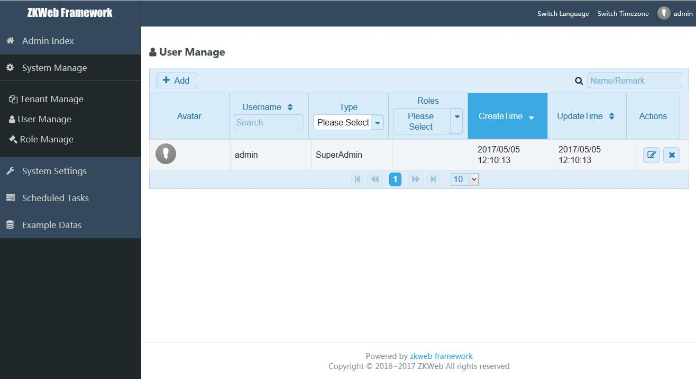

MVVM demo for zkweb framework



### Features

- Use AngularJS 4.0 + Webpack 2.0
    - Support automatic generate script form dto and application service
    - Support return pre-compressed script bundle
    - Support CORS api request
- Use Entity Framework Core
- Use Swagger
- Use AutoMapper
- Support .Net Core
- Support multi-tenant
- Support multi-language
- Support multi-timezone
- Support scheduled task
- Support unit of work
    - Support query filter
    - Support operation filter
- Support automatic validate DTOs from request
- Provide default admin panel with PrimeNG
    - Support manage tenants
    - Support manage roles
    - Support manage users
- Provide command line compile and publish script
- Provide Dockerfile, support running in docker

### How to start

**Use taobao npm mirror if needed**

```
npm config set registry http://registry.npm.taobao.org
npm config set sass_binary_site http://npm.taobao.org/mirrors/node-sass
```

**Build website files**

```
cd src/ZKWeb.MVVMPlugins/MVVM.Angular.Website/static
npm install
npm run build
```

**Modify database configuration"

Open `ZKWeb.MVVMDemo.AspNetCore\App_Data\config.json` and modify database configuration.

**Start website**

Open `ZKWeb.MVVMDemo.sln` with VS2017 and run the project.

**Use webpack-dev-server (optional)**

If you want more verbose error message and faster recompilation you can use webpack-dev-server, <br/>
Run following command and open `http://127.0.0.1:3000` in your browser.

```
npm run dev
```

### Documents

- [Chinese Documents(中文文档)](./docs/cn)

### LICENSE

MIT LICENSE<br/>
Copyright © 2017 303248153@github<br/>
If you have any license issue please contact 303248153@qq.com.<br/>
