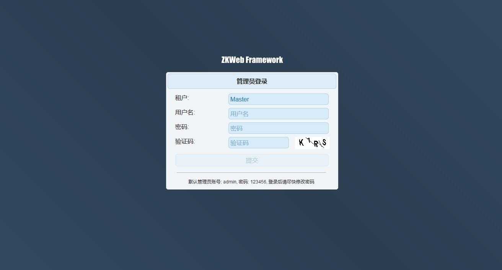
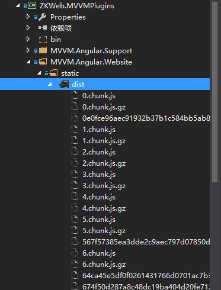
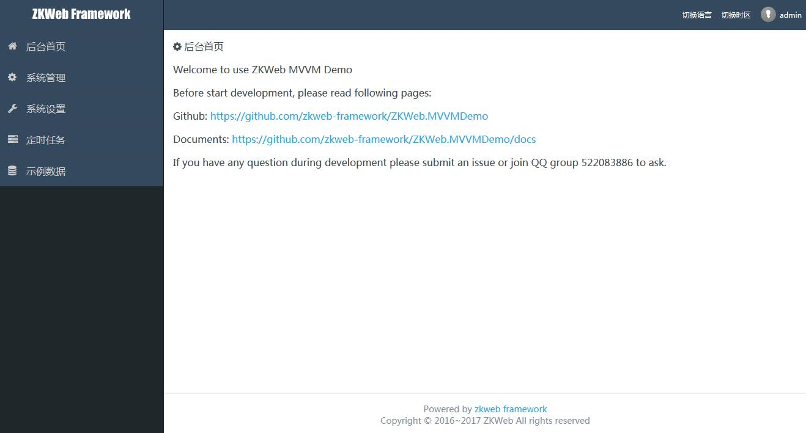
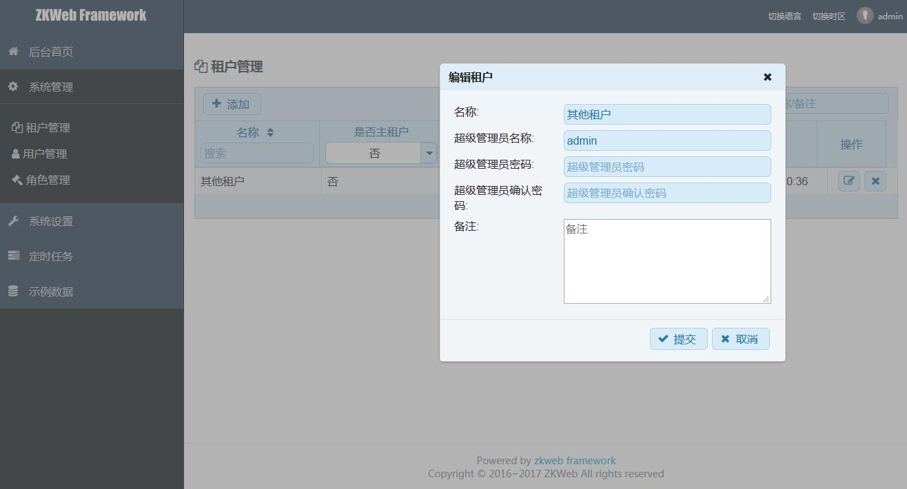
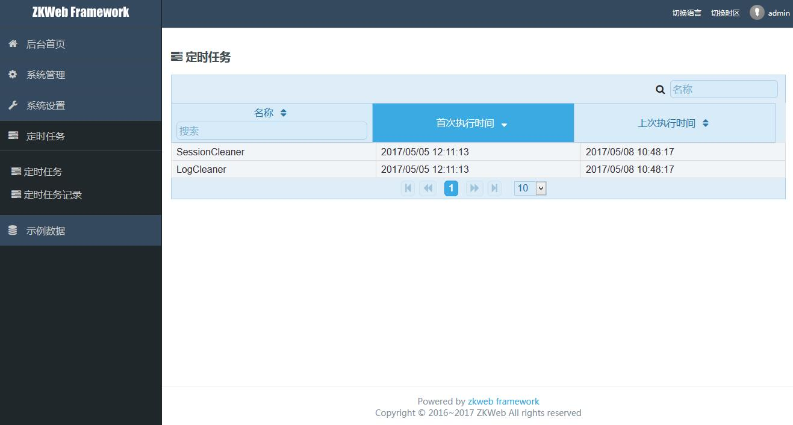

# 管理后台的说明

如果你已经按照文档首页的"如何开始"操作过，运行项目后应该可以看见下面的页面

如果你看到的是空白页面或者404，代表你未正确的编译前端的网页文件，请检查以下的文件夹是否存在

初次登陆需要用默认的管理员账号和用户名，分别如下

- 用户名 admin
- 密码 123456

登录后可以看到下面的页面

左边是导航栏，右边是用户菜单栏，点击用户菜单栏下的关于网站可以查看当前的网站信息

Demo提供的后台可以管理租户，用户和角色

只有主租户"Master"可以管理其他租户

管理租户时可以创建他们的超级管理员和设置密码，使用该租户和创建的管理员登录可以管理该租户下的数据

在定时任务这里可以看到任务的运行状况和历史记录

如何往这个管理后台添加新功能请参考后面关于前端的文档
