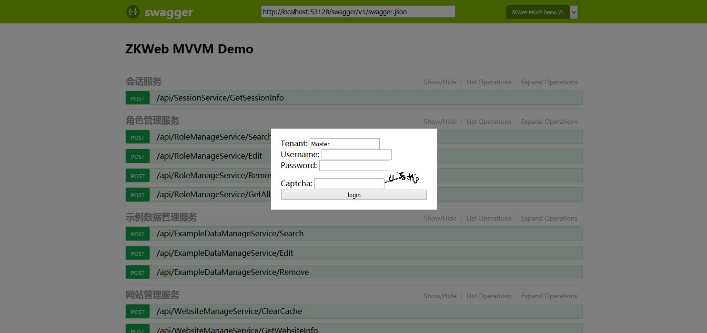
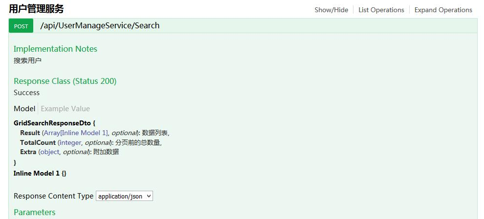
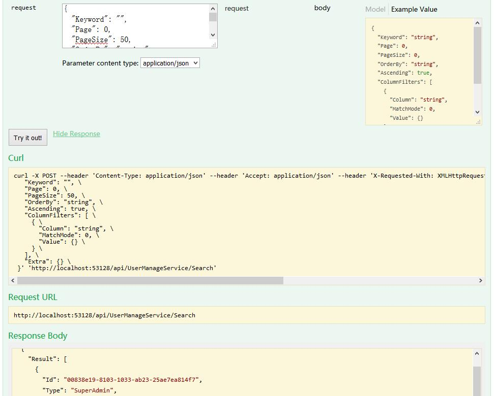

# 添加和测试API

### **API的文件结构**

建立Api时，推荐按以下的结构来保存文件

[应用层文件结构](img/plugin_application_source.jpg)

- Application: 应用层的代码
  - Dtos: 保存数据传输对象的文件夹
  - Mappers: 保存AutoMapper配置的文件夹
  - Services: 保存Api服务的文件夹

### **定义数据传输对象**

与前端交互的数据应该单独定义出来，例如

``` csharp
[Description("示例数据的传入信息")]
public class ExampleDataInputDto : IInputDto
{
    [Description("数据Id")]
    public Guid Id { get; set; }
    [Description("数据名称"), Required]
    public string Name { get; set; }
    [Description("数据描述")]
    public string Description { get; set; }
}
```

``` csharp
[Description("示例数据的传出信息")]
public class ExampleDataOutputDto : IOutputDto
{
    [Description("数据Id")]
    public Guid Id { get; set; }
    [Description("数据名称")]
    public string Name { get; set; }
    [Description("数据描述")]
    public string Description { get; set; }
    [Description("创建时间")]
    public string CreateTime { get; set; }
    [Description("更新时间")]
    public string UpdateTime { get; set; }
}
```

其中前端传给后端的对象应该标记`IInputDto`，标记后会在传入时自动验证是否合法，例如上面的`Name`属性如果为空则请求时会自动抛出错误给前端

后端传给前端的对象则应该标记`IOutputDto`，后端的DateTime转为前端的string时会自动从utc时间转为前端指定的时区时间，不需要额外的处理

### **定义AutoMapper配置**

定义完数据传输对象后还需要定义AutoMapper使用的配置，继承`Profile`并标记`[ExportMany]`属性注册到容器，如下

``` csharp
/// <summary>
/// AutoMapper的配置
/// </summary>
[ExportMany]
public class CrudExampleMapperProfile : Profile
{
    public CrudExampleMapperProfile()
    {
        CreateMap<ExampleData, ExampleDataOutputDto>();
        CreateMap<ExampleDataInputDto, ExampleData>();
    }
}
```

### **添加Api服务**

添加Api服务需要继承`ApplicationServiceBase`并标记`[ExportMany]`属性注册到容器，如下

``` csharp
/// <summary>
/// 示例数据管理服务
/// </summary>
[ExportMany, SingletonReuse, Description("示例数据管理服务")]
public class ExampleDataManageService : ApplicationServiceBase
{
    private ExampleDataManager _exampleDataManager;

    public ExampleDataManageService(ExampleDataManager exampleDataManager)
    {
        _exampleDataManager = exampleDataManager;
    }

    [Description("搜索数据")]
    [CheckPrivilege(typeof(IAmAdmin), "ExampleData:View")]
    public GridSearchResponseDto Search(GridSearchRequestDto request)
    {
        return request.BuildResponse<ExampleData, Guid>()
            .FilterKeywordWith(t => t.Name)
            .FilterKeywordWith(t => t.Description)
            .ToResponse<ExampleDataOutputDto>();
    }

    [Description("编辑数据")]
    [CheckPrivilege(typeof(IAmAdmin), "ExampleData:Edit")]
    public ActionResponseDto Edit(ExampleDataInputDto dto)
    {
        var data = _exampleDataManager.Get(dto.Id) ?? new ExampleData();
        Mapper.Map(dto, data);
        _exampleDataManager.Save(ref data);
        return ActionResponseDto.CreateSuccess("Saved Successfully");
    }

    [Description("删除数据")]
    [CheckPrivilege(typeof(IAmAdmin), "ExampleData:Remove")]
    public ActionResponseDto Remove(Guid id)
    {
        _exampleDataManager.Delete(id);
        return ActionResponseDto.CreateSuccess("Deleted Successfully");
    }
}
```

在上面的代码中

- SingletonReuse属性表示该服务为单例
- Description属性可以让swagger和前端看到服务和函数的描述
- CheckPrivilege用于检查权限，第一个参数是需要的用户类型，第二个参数是需要的权限
    - 第二个参数可以任意写，权限系统会自动收集CheckPrivilege的参数作为系统中的所有权限
- GridSearchRequestDto是表格请求使用的dto，可以用于构建回应，支持自动按列过滤和排序
- GridSearchResponseDto是表格回应使用的dto
- ActionResponseDto用于通用的操作结果，传入的信息会自动翻译

### **测试API服务**

这个Demo提供了swagger支持，你可以使用swagger来测试API服务

使用swagger需要登陆，使用后台的用户名密码登录即可，如下图



登录成功后可以看到各个API


和API的描述



还可以使用swagger来测试API



### **API的调用**

为了简便，定义的API默认都只接受POST调用，你可以修改ApplicationServiceBase来改变这个策略，另外Demo默认支持跨站调用Api，不需要额外的标记

添加的DTO和API服务会自动生成前端的脚本，前端可以使用生成的函数来调用API，请参考后面的文档
