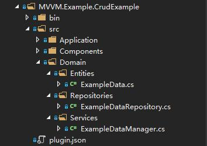

# 实体的建立

这个Demo使用了Entity Framework Core管理实体，实体的创建和修改会全自动反映到数据库中，不需要执行ef的迁移命令

请注意重命名字段会导致原有字段被删除，请慎重修改已有的实体并做好定期备份

推荐在`src\Domain`下建立实体相关的文件，如下图



(1) 首先在Entities下建立实体，例如

``` csharp
using System;
using ZKWeb.Database;
using ZKWeb.MVVMPlugins.MVVM.Common.Base.src.Domain.Entities.Interfaces;
using ZKWeb.MVVMPlugins.MVVM.Common.MultiTenant.src.Domain.Entities;
using ZKWeb.MVVMPlugins.MVVM.Common.MultiTenant.src.Domain.Entities.Interfaces;
using ZKWebStandard.Ioc;

namespace ZKWeb.MVVMPlugins.MVVM.Example.CrudExample.src.Domain.Entities
{
    /// <summary>
    /// 实例数据
    /// </summary>
    [ExportMany]
    public class ExampleData :
        IEntity<Guid>,
        IHaveCreateTime,
        IHaveUpdateTime,
        IHaveDeleted,
        IHaveOwnerTenant,
        IEntityMappingProvider<ExampleData>
    {
        /// <summary>
        /// 数据Id
        /// </summary>
        public virtual Guid Id { get; set; }
        /// <summary>
        /// 名称
        /// </summary>
        public virtual string Name { get; set; }
        /// <summary>
        /// 描述
        /// </summary>
        public virtual string Description { get; set; }
        /// <summary>
        /// 创建时间
        /// </summary>
        public virtual DateTime CreateTime { get; set; }
        /// <summary>
        /// 更新时间
        /// </summary>
        public virtual DateTime UpdateTime { get; set; }
        /// <summary>
        /// 是否已删除
        /// </summary>
        public virtual bool Deleted { get; set; }
        /// <summary>
        /// 所属租户
        /// </summary>
        public virtual Tenant OwnerTenant { get; set; }
        /// <summary>
        /// 所属租户Id
        /// </summary>
        public virtual Guid OwnerTenantId { get; set; }

        /// <summary>
        /// 配置数据库结构
        /// </summary>
        public void Configure(IEntityMappingBuilder<ExampleData> builder)
        {
            builder.Id(e => e.Id);
            builder.Map(e => e.Name, new EntityMappingOptions() { Index = "Idx_ExampleData_Name" });
            builder.Map(e => e.Description);
            builder.Map(e => e.CreateTime, new EntityMappingOptions() { Index = "Idx_ExampleData_CreateTime" });
            builder.Map(e => e.UpdateTime);
            builder.Map(e => e.Deleted);
            builder.References(e => e.OwnerTenant, new EntityMappingOptions() { Nullable = false });
        }
    }
}

```

在这份代码中:

- [ExportMany]表示注册到容器中
- IHaveCreateTime, IHaveUpdateTime等等是约束接口，添加后可以实现自动填写创建时间和修改时间
- IHaveOwnerTenant表示该数据可以根据租户进行隔离
- IEntityMappingProvider用于提供该实体的字段定义
- builder.Id指定主键
- builder.Map指定字段
- builder.References指定多对一的关系，另外还有builder.HasMany可以指定一对多

创建实体后刷新网站就可以看到实体创建到数据库中，不需要执行ef相关的命令

(2) 在Repositories下建立仓储，例如

``` csharp
using Microsoft.EntityFrameworkCore;
using System;
using System.Linq;
using ZKWeb.MVVMPlugins.MVVM.Common.Base.src.Domain.Repositories.Bases;
using ZKWeb.MVVMPlugins.MVVM.Example.CrudExample.src.Domain.Entities;
using ZKWebStandard.Ioc;

namespace ZKWeb.MVVMPlugins.MVVM.Example.CrudExample.src.Domain.Repositories
{
    /// <summary>
    /// 示例数据的仓储
    /// </summary>
    [ExportMany]
    public class ExampleDataRepository : RepositoryBase<ExampleData, Guid>
    {
        /// <summary>
        /// 查询时包含关联数据
        /// </summary>
        /// <returns></returns>
        public override IQueryable<ExampleData> Query()
        {
            return base.Query().Include(e => e.OwnerTenant);
        }
    }
}
```

在这份代码中:

- [ExportMany]表示注册到容器中
- override IQueryable表示重载查询函数，会影响Get, Count等仓储中其他所有查询相关的函数
- Include(e => e.OwnerTenant)表示查询数据时要同时包含租户信息，因为EFCore不支持懒加载所以需要这样指定

(3) 在Services下建立领域服务，例如

``` csharp
using System;
using ZKWeb.MVVMPlugins.MVVM.Common.Base.src.Domain.Services.Bases;
using ZKWeb.MVVMPlugins.MVVM.Example.CrudExample.src.Domain.Entities;
using ZKWebStandard.Ioc;

namespace ZKWeb.MVVMPlugins.MVVM.Example.CrudExample.src.Domain.Services
{
    /// <summary>
    /// 示例数据管理器
    /// </summary>
    [ExportMany, SingletonReuse]
    public class ExampleDataManager : DomainServiceBase<ExampleData, Guid>
    {
    }
}

```

业务相关的代码都推荐加到这个类中

推荐添加实体时遵守以上的步骤，分别添加实体，仓储和领域服务，

并且把业务写到领域服务里面，领域服务需要时可以注入多个仓储来进行跨表操作
