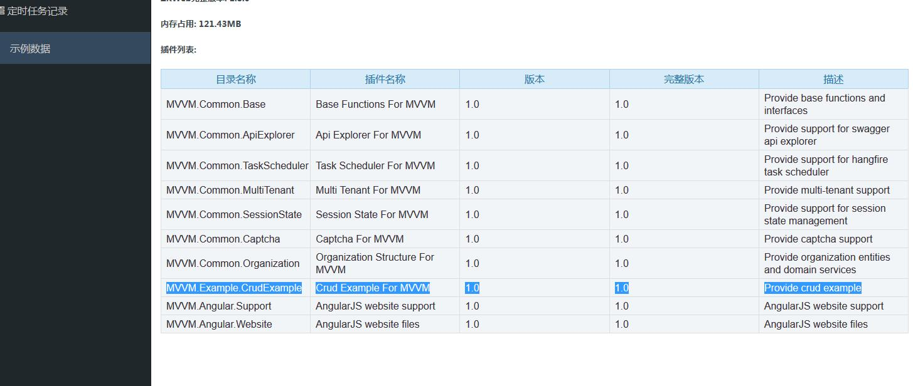
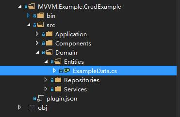

# 插件的建立

你可以按照下面的步骤添加一个新的插件

(1) 在项目ZKWeb.MVVMPlugins下添加一个新的文件夹，例如`MVVM.Example.CrudExample`

(2) 在新文件夹下建立plugin.json 格式如下:

``` json
{
    "Name": "插件名称",
    "Version": "1.0",
    "Description": "插件描述",
    "Dependencies": [ "MVVM.Common.Base", "MVVM.Common.Organization" ]
}
```

(3) 打开`App_Data\config.json`，把建立的文件夹名称添加到"Plugins"列表中，推荐添加到MVVM.Angular开头的插件前:

```
{
    "ORM": "EFCore",
    "Database": "SQLite",
    "ConnectionString": "Data Source={{App_Data}}/test.db;",
    "PluginDirectories": [
        "../ZKWeb.MVVMPlugins"
    ],
    "Plugins": [
        "MVVM.Common.Base",
        "MVVM.Common.ApiExplorer",
        "MVVM.Common.TaskScheduler",
        "MVVM.Common.MultiTenant",
        "MVVM.Common.SessionState",
        "MVVM.Common.Captcha",
        "MVVM.Common.Organization",
        "MVVM.Example.CrudExample",
        "MVVM.Angular.Support",
        "MVVM.Angular.Website"
    ]
}
```
建立插件后打开后台，点击右上角的用户菜单下的"关于网站"，在插件列表中看到这个插件就表示建立成功了



之后你可以在这个插件下添加程序代码，程序代码需要放在子src文件夹下，如下图

在src文件夹外的源代码不会参与编译



更多的内容可以参考ZKWeb的文档

- [插件系统](http://zkweb-framework.github.io/cn/site/core/plugin/index.html)
