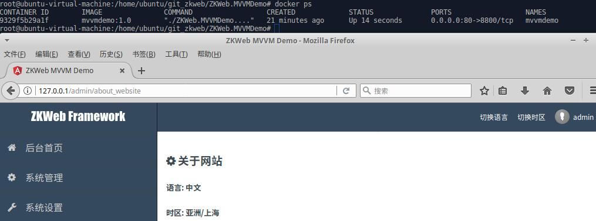

# 在Docker上运行

在Docker上运行之前，请先确保网站已经运行成功，并且你已经按前一篇文档[在Ubuntu上开发和打包](./UbuntuSupport.md)中的步骤发布了网站

如果你已经发布网站，并且确认`ZKWeb.MVVMDemo/publish`文件夹存在就可以继续下面的步骤

### **构建Docker镜像**

`cd`到`ZKWeb.MVVMDemo`文件夹, 并执行以下命令

``` sh
docker build -t mvvmdemo:1.0 .
```

构建成功以后运行以下命令可以看到刚才创建的镜像

``` sh
docker images
```

### **运行Docker镜像**

执行以下命令即可运行刚才创建的Docket镜像

``` sh
docker run --name mvvmdemo -p 80:8800 mvvmdemo:1.0
```

如果需要后台运行可以使用以下命令

``` sh
docker run --name mvvmdemo -d -p 80:8800 mvvmdemo:1.0
```

运行完以后执行以下命令可以看到运行状态

``` sh
docker ps
```



之后如果需要停止或者启动容器可以使用stop和start命令

```
docker stop mvvmdemo
docker start mvvmdemo
```

### **其他docker命令**

这些是除了上面的命令以外的常用docker命令

- `docker logs mvvmdemo`
	- 查看后台运行的容器的输出记录
- `docker exec -it mvvmdemo bash`
	- 在已有的容器中运行自定义命令
- `docker attach mvvmdemo`
	- 挂接到已有的容器

### **配合nginx**

TODO
