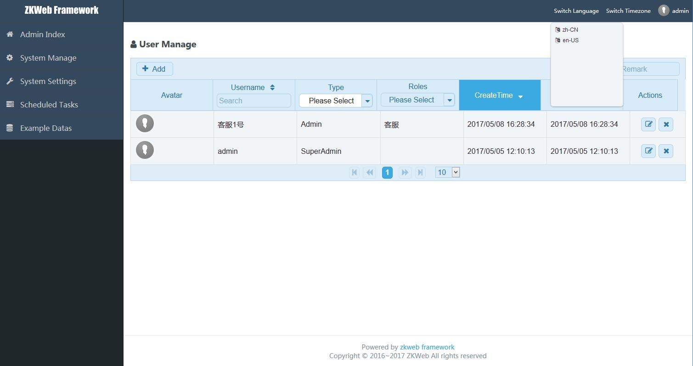

# 多语言和多时区

Demo提供了多语言和多时区的支持，前端可以指定当前使用的语言和时区，如下图



### **如何提供翻译**

文本的翻译统一由后端提供，后端提供的翻译会自动生成前端的脚本，提供翻译需要继承`DictionaryTranslationProviderBase`并注册到容器

翻译应该标记为单例，否则有性能上的影响

``` csharp
/// <summary>
/// 中文翻译
/// </summary>
[ExportMany, SingletonReuse]
public class zh_CN : DictionaryTranslationProviderBase
{
    /// <summary>
    /// 初始化
    /// </summary>
    public zh_CN()
    {
        Codes = new HashSet<string>() { "zh-CN" };
        Translates = new Dictionary<string, string>()
        {
            { "Submit", "提交" },
            { "Cancel", "取消" },
            { "{0} is required", "请填写{0}" },
        }
    }
}
```

### **如何翻译文本**

翻译文本会根据当前请求要求的语言翻译

后端翻译文本可以使用`new T(原文)`翻译，例如

``` csharp
string translated = new T("Original");
```

也可以调用`TranslationManager`翻译，例如

``` csharp
var translateManager = ZKWeb.Application.Ioc.Resolve<TranslateManager>();
var translated = translateManager.Translate("Original");
```

前端翻译文本请看后面的文档

### **如何转换时区**

转换时区会根据当前请求要求的时区转换，后端应该统一使用UTC时间，前端应该统一使用本地时间

后端时间转前端时间可以使用以下的代码，`ToClientTime`是`ZKWebStandard.Extensions`下的扩展函数

``` csharp
var now = DateTime.UtcNow;
var clientNow = now.ToClientTime();
```

前端时间转后端时间可以使用以下的代码，`FromClientTime`也是`ZKWebStandard.Extensions`下的扩展函数

``` csharp
var clientTime = DateTime.Parse(clientTimeString);
var utcTime = clientTime.FromClientTime();
```

Demo默认提供了AutoMapper自动转换时区的设置，实现如下

``` csharp
CreateMap<DateTime, string>().ConvertUsing(d => d.ToClientTimeString());
CreateMap<string, DateTime>().ConvertUsing(s => s.ConvertOrDefault<DateTime>().FromClientTime());
```

时间通过AutoMapper转换为字符串时会自动转换成客户端时区的时间，反过来会自动转换为UTC的时间

### **切换当前的语言和时区**

DEMO默认会根据客户端传入的Http头设置当前的语言和时区，其中语言的头是`X-ZKWeb-Language`，时区的头是`X-ZKWeb-Timezone`

如果需要手动设置当前的语言和时区可以使用以下的代码

``` csharp
LocaleUtils.SetThreadLanguage("zh-CN");
LocaleUtils.SetThreadTimezone("Asia/Shanghai");
```

### **如何不使用多语言**

如果不想使用多语言，可以直接在原文处写中文即可，翻译系统找不到对应的翻译时会自动使用原文

### **如何不使用多时区**

如果不想使用多时区，需要修改代码，步骤如下

- 替换代码中的`DateTime.UtcNow`到`DateTime.Now`
- 去掉代码中的`ToClientTime()`
- 去掉代码中的`FromClientTime()`
- 替换代码中的`ToClientTimeString()`到`ToString("yyyy/MM/dd HH:mm:ss")`
- 查找是否有其他用utc时间的部分，统一改成本地时间
