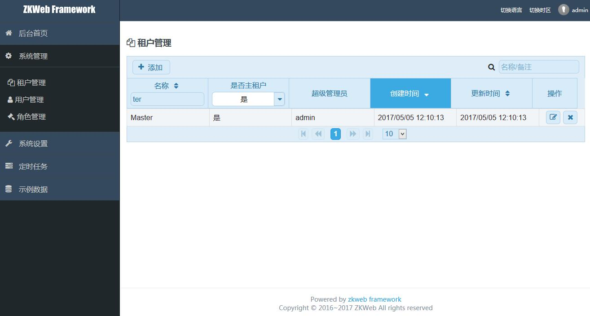

# 多租户

这个Demo实现了多租户功能，各个租户的数据都会存在同一个数据库中，并且以一个租户字段隔离

## **如何让实体支持多租户**

让实体继承`IHaveOwnerTenant`接口即可，这个接口的定义如下

``` csharp
/// <summary>
/// 包含所属租户的接口
/// </summary>
public interface IHaveOwnerTenant : IEntity
{
    /// <summary>
    /// 所属的租户
    /// </summary>
    Tenant OwnerTenant { get; set; }
    /// <summary>
    /// 所属的租户Id
    /// </summary>
    Guid OwnerTenantId { get; set; }
}
```

查询数据时会自动按当前租户进行过滤，保存时如果是新建的数据则会设置租户，否则会防止修改其他租户的数据

## **如何确定当前的租户**

当前的租户默认是当前登录用户的所属租户决定，决定租户会使用以下的接口，你可以添加自己的提供器来实现按域名来决定租户

``` csharp
/// <summary>
/// 当前租户的提供器
/// 可以注册多个，任意一个提供器返回租户时则使用该租户
/// </summary>
public interface ITenantProvider
{
    /// <summary>
    /// 获取当前租户
    /// 获取不到时可以返回null
    /// </summary>
    /// <returns></returns>
    Tenant GetTenant();
}
```

## **如何获取当前的租户**

可以使用以下的代码获取当前租户

``` csharp
var tenantManager = ZKWeb.Application.Ioc.Resolve<TenantManager>();
var tenant = tenantManager.GetTenant();
```

## **如何管理租户**

管理后台提供了租户管理功能，可以添加编辑和删除租户，添加租户时可以设置该租户的超级管理员，也可以修改已有租户的超级管理员密码，租户管理只有主租户"Master"可以使用



注意各个租户的数据相互隔离，不同的租户中用户名是可以一样的
