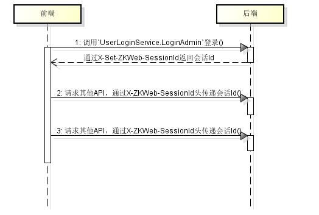
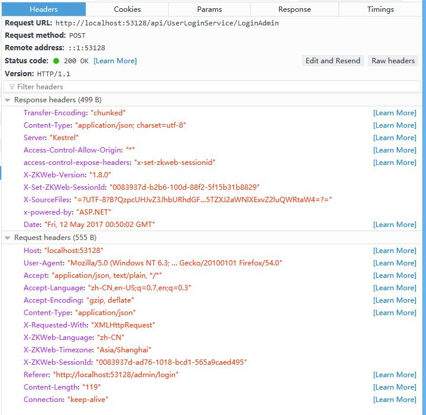
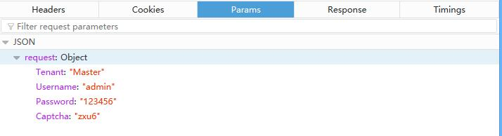
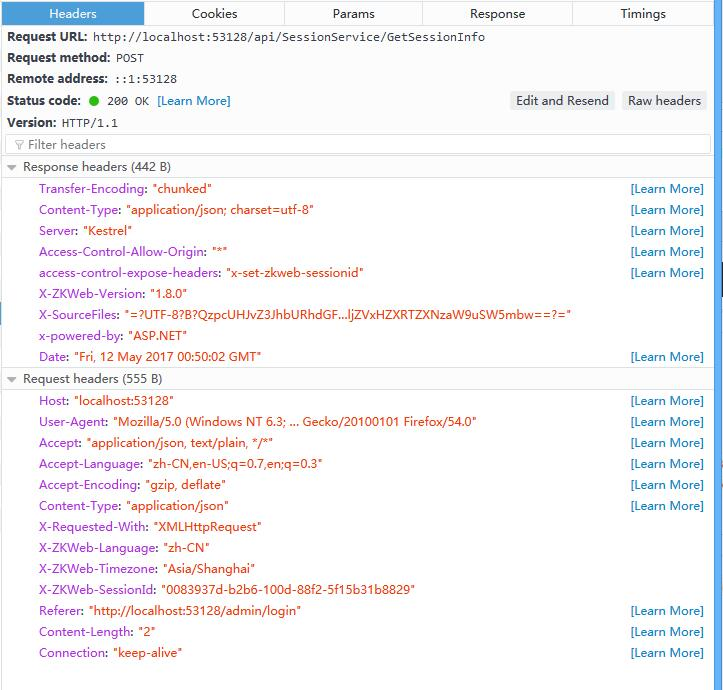

# 前端的用户登录流程

Demo使用了会话的方式管理用户数据（前后端只通过会话Id交互），并且会话Id使用Http头传输

用户登录的流程如下

- 前端调用`UserLoginService.LoginAdmin`函数登录
- 后端接收到登录请求后验证用户名和密码，通过后创建一个新的会话
- 后端把新的会话Id通过`X-Set-ZKWeb-SessionId`发给前端
- 前端的`AppApiService`收到这个头以后把会话Id设置到本地
- 在用户退出之前，前端`AppApiService`发送给后端的请求都会带`X-ZKWeb-SessionId`头，内容是会话Id

如图

这是登录请求的详细信息，可以看到首先发过去了用户名和密码，然后服务端判断登录成功后返回了`X-Set-ZKWeb-SessionId`头，后续前端到后端的请求都会带`X-ZKWeb-SessionId`头

前端可以通过`AppSessionService.getSessionInfo`获取当前的会话信息，包含用户和角色，拥有的权限列表等
