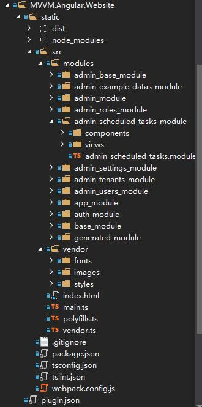

# 前端的项目结构

Angular的前端文件储存在`src\ZKWeb.MVVMPlugins\MVVM.Angular.Website\static`下，打开可以看到以下的结构



它们的作用如下

- dist: webpack生成的最终前端文件，发布时只需要这个文件夹
- node_modules: npm安装的库
- src: 前端源代码
  - modules: 保存前端模块的文件夹
    - admin_base_module: 后台的基础模块，包含导航菜单等，其他后台模块需要引用此模块
    - admin_module: 后台主模块，包含后台的路由信息，其他后台模块不能引用此模块
    - admin_example_datas_module: 管理示例数据的模块
    - admin_roles_module: 管理角色的模块
    - admin_scheduled_tasks_module: 管理定时任务的模块
    - admin_settings_module: 管理后台设置的模块
    - admin_tenants_module: 管理租户的模块
    - admin_users_module: 管理用户的模块
    - app_module: 程序主模块，其他模块不能引用此模块
    - auth_module: 认证模块，提供用户身份认证和权限检查等
    - base_module: 基础模块，包含基础组件和服务
    - generated_module： 生成模块，包含由后端Dto和API服务生成的代码
  - vendor: 第三方资源文件
    - fonts: 字体文件
    - images: 图片文件
    - styles: 样式文件
  - index.html: Html主程序文件
  - main.ts: Angular主程序文件
  - polyfills.ts: 用于引用为旧浏览器提供新功能支持的脚本
  - vendor.ts: 用于引用第三方脚本
- .gitignore: git忽略文件，这里用于忽略dist和node_modules
- package.json: npm库文件，用于指定当前包名称和需要安装哪些包
- tsconfig.json: TypeScript设置
- tslint.json: TypeScript规范设置，使用npm run lint可以检查代码规范
- webpack.config.js: Webpack设置，使用npm run build可以编译和打包前端

### **路由的定义**

app_module负责定义全局的路由，打开`app_module\app.module.ts`可以看到

admin是子路由，并且使用了懒加载的方式加载admin_module

``` typescript
const routes: Routes = [
    { path: '', redirectTo: '/admin', pathMatch: 'full' },
    { path: 'admin', loadChildren: '../admin_module/admin.module#AdminModule' },
    { path: '**', component: PageNotFoundComponent }
];
```

再来看`admin_module\admin.module.ts`可以看到

``` typescript
const routes: Routes = [
    {
        path: "",
        component: AdminContainerComponent,
        canActivate: [AuthGuard],
        data: { auth: { requireUserType: UserTypes.ICanUseAdminPanel } },
        children:
        [
            {
                path: '', component: AdminIndexComponent, pathMatch: "full"
            },
            {
                path: 'about_website', component: AdminAboutWebsiteComponent,
                canActivate: [AuthGuard],
                data: { auth: { requireUserType: UserTypes.ICanUseAdminPanel } }
            },
            {
                path: 'about_me', component: AdminAboutMeComponent,
                canActivate: [AuthGuard],
                data: { auth: { requireUserType: UserTypes.ICanUseAdminPanel } }
            },
            { path: 'tenants', loadChildren: '../admin_tenants_module/admin_tenants.module#AdminTenantsModule' },
            { path: 'users', loadChildren: '../admin_users_module/admin_users.module#AdminUsersModule' },
            { path: 'roles', loadChildren: '../admin_roles_module/admin_roles.module#AdminRolesModule' },
            { path: 'settings', loadChildren: '../admin_settings_module/admin_settings.module#AdminSettingsModule' },
            { path: 'scheduled_tasks', loadChildren: '../admin_scheduled_tasks_module/admin_scheduled_tasks.module#AdminScheduledTasksModule' },
            { path: 'example_datas', loadChildren: '../admin_example_datas_module/admin_example_datas.module#AdminExampleDatasModule' }

        ]
    },
    { path: 'login', component: AdminLoginComponent } 
];
```

如果需要加更多的页面可以仿照上面的写法在`app.module.ts`或者`admin.module.ts`下加路由

### **基础服务**

Demo中提供了一些基础服务，以下是它们的列表

- base_module\services
  - AppApiService: 调用远程Api的服务
  - AppConfigService: 保存全局配置的服务
  - AppTranslationService: 提供文本翻译的服务
- auth_module\services
  - AppPrivilegeService: 检查权限使用的服务
  - AppSessionService: 获取会话信息的服务
- admin_base_module\services
  - AdminToastService: 在后台页面显示悬浮信息的服务
