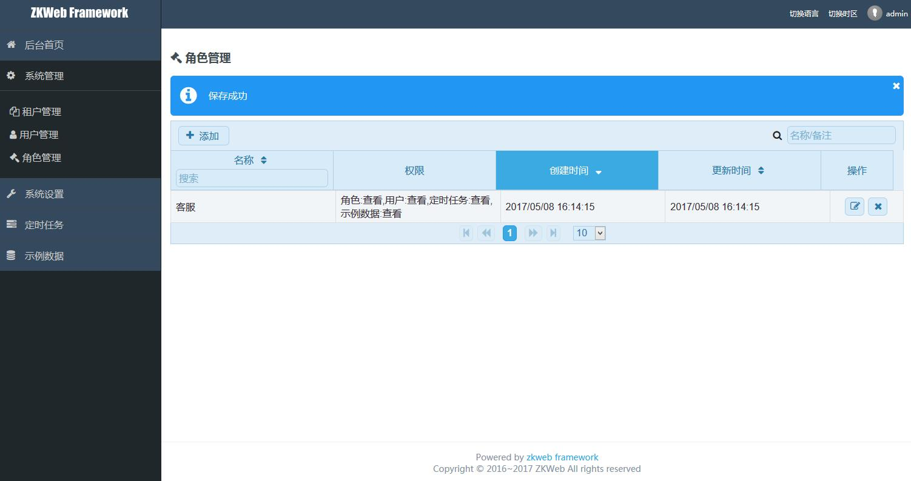
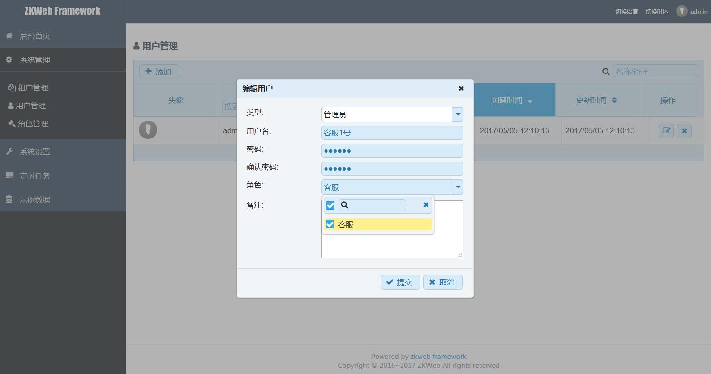

# 组织架构的说明

这个Demo提供了一套最基本的组织架构，包含了以下的元素

- Role: 角色，和用户是多对多关系，可以分配多个权限
- User: 用户，和角色是多对多的关系，默认有以下的用户类型
  - Admin: 管理员
  - SuperAdmin: 超级管理员
  - User: 普通用户

### **用户类型**

为了更灵活的表现用户类型，这个Demo使用了接口而不是枚举，Demo中的用户类型和接口关系如下

- interface IAmAdmin : IAmUser, ICanUseAdminPanel
- interface IAmAnonymouseUser : IUserType
- interface IAmSuperAdmin : IAmAdmin 
- interface IAmUser : IUserType
- interface ICanUseAdminPanel : IUserType
- interface IUserType
- class AdminUserType : IAmAdmin
- class NormalUserType : IAmUser
- class SuperAdminUserType : IAmSuperAdmin

需要增加更多的用户类型可以依照上面的实现，判断权限推荐根据接口来判断，
例如`[CheckPrivilege(typeof(IAmAdmin))]`，
这样所有继承了`IAmAdmin`的用户类型都可以通过检查

`IAmSuperAdmin`是特殊类型，继承了这个类型的用户会跳过并通过所有具体的权限检查

### **角色与权限**

这个Demo中的权限是一个字符串，表现权限列表的时候也可以简单的使用`string[]`，权限的命名推荐遵守以下的规则

```
分组:名称或操作
```

例如`ExampleData:View`会被翻译为`示例数据:查看`

一个角色可以分配多个权限，调用`Role.GetPrivileges`和`Role.SetPrivileges`可以获取和设置角色的权限列表

### **管理角色**

管理后台提供了管理角色功能，角色拥有的权限可以多选，如下图



### **管理用户**

管理后台提供了管理用户功能，用户对应的角色可以多选，如下图



### **API检查权限**

API服务中检查权限可以使用`CheckPrivilege`属性，例如以下的函数要求用户类型继承了`IAmAdmin`，并且拥有`ExampleData:View`权限

``` csharp
[CheckPrivilege(typeof(IAmAdmin), "ExampleData:View")]
public GridSearchResponseDto Search(GridSearchRequestDto request)
{
    return request.BuildResponse<ExampleData, Guid>()
        .FilterKeywordWith(t => t.Name)
        .FilterKeywordWith(t => t.Description)
        .ToResponse<ExampleDataOutputDto>();
}
```

`CheckPrivilege`有两个构造函数，第二个函数可以指定是否要求当前的用户属于主租户

例如租户管理都要求当前用户是主租户，否则不能管理其它租户

``` csharp
public CheckPrivilegeAttribute(Type requiredUserType, params string[] privileges);
public CheckPrivilegeAttribute(bool requireMasterTenant, Type requiredUserType, params string[] privileges)
```

权限检查不通过时会自动抛出403错误，客户端应该做好错误的处理

### **手动检查权限**

除了使用以上的方式检查权限以外，还可以手动调用权限管理器来检查用户权限，代码如下

``` csharp
var requirement = new AuthRequirement(
    requireMasterTenant,
    requireUserType,
    requirePrivileges);
var privilegeManager = ZKWeb.Application.Ioc.Resolve<PrivilegeManager>();
privilegeManager.Check(requirement);
```

`Check`函数会获取当前登录的用户，并在检查不通过时会抛出错误，如果想检查其他用户可以使用`IsAuthorized`函数

```
var requirement = new AuthRequirement(
    requireMasterTenant,
    requireUserType,
    requirePrivileges);
var privilegeManager = ZKWeb.Application.Ioc.Resolve<PrivilegeManager>();
var sessionManager = ZKWeb.Application.Ioc.Resolve<SessionManager>();
var user = sessionManager.GetSession().GetUser();
string errorMessage;
var passed = privilegeManager.IsAuthorized(user, requirement, out errorMessage));
```

### **定制权限系统**

Demo自带的权限系统可能不能满足你的要求，如果你想自定义权限系统可以先参考`IPrivilegesProvider`和`OwnerFilter`，也欢迎进ZKWeb的QQ群讨论

前端的权限检查请查看后面的文档
