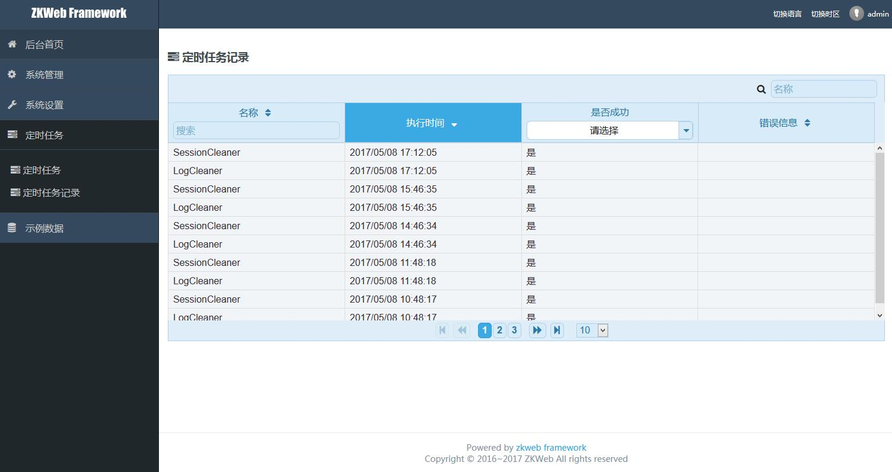

# 添加定时任务

Demo支持添加定时任务，定时任务在网站的后台执行

和其他定时任务框架一样，网站不运行的时候定时任务也无法运行，如果需要确保任务运行的话请[设置IIS进程池的常驻](http://docs.hangfire.io/en/latest/deployment-to-production/making-aspnet-app-always-running.html)

### **添加定时任务**

添加定时任务需要继承`IScheduledTask`并标记`[ExportMany]`注册到容器，如下

``` csharp
/// <summary>
/// 日志清理器
/// 每小时删除一次旧的日志
/// 日志保留时间
///        Debug 3天
///        Info 3天
///        Error 30天
///        Transaction 30天
/// </summary>
[ExportMany, SingletonReuse]
public class LogCleaner : IScheduledTask
{
    /// <summary>
    /// 任务键名
    /// </summary>
    public string Key { get { return "LogCleaner"; } }

    /// <summary>
    /// 每小时执行一次
    /// </summary>
    public bool ShouldExecuteNow(DateTime lastExecuted)
    {
        return ((DateTime.UtcNow - lastExecuted).TotalHours > 1.0);
    }

    /// <summary>
    /// 删除过期的日志
    /// </summary>
    public void Execute()
    {
        var now = DateTime.UtcNow.ToLocalTime();
        var count = 0;
        var fileStorage = ZKWeb.Application.Ioc.Resolve<IFileStorage>();
        var logsDirectory = fileStorage.GetStorageDirectory("logs");
        if (!logsDirectory.Exists)
        {
            return;
        }
        foreach (var fileEntry in logsDirectory.EnumerateFiles())
        {
            // 从文件名获取日志等级和记录日期
            var filename = fileEntry.Filename;
            var parts = filename.Split('.');
            if (parts.Length != 3 || parts[2] != "log")
            {
                continue;
            }
            DateTime createTime;
            if (!DateTime.TryParseExact(parts[1],
                "yyyyMMdd", null, DateTimeStyles.None, out createTime))
            {
                continue;
            }
            // 判断保留时间，超过时删除
            var timeSpan = now - createTime;
            if (((parts[0] == "Debug" || parts[0] == "Info") && timeSpan.TotalDays > 3) ||
                ((parts[0] == "Error" || parts[0] == "Transaction") && timeSpan.TotalDays > 30))
            {
                fileEntry.Delete();
                ++count;
            }
        }
        var logManager = ZKWeb.Application.Ioc.Resolve<LogManager>();
        logManager.LogInfo(string.Format(
            "LogCleaner executed, {0} files removed", count));
    }
}
```

### **查看定时任务的执行情况**

后台可以查看定时任务的最后执行时间和执行记录等，如下




如果任务执行失败了可以在定时任务记录中看到失败的消息
